<div align="center">


# IMPI

### Learn Conservation Through Conversation

**Identity Proxy Project**

**Iné Smith**  
**Student Number: 221076**  
**Postgraduate Diploma (PGD)**  
**Open Window Institute**

<br>

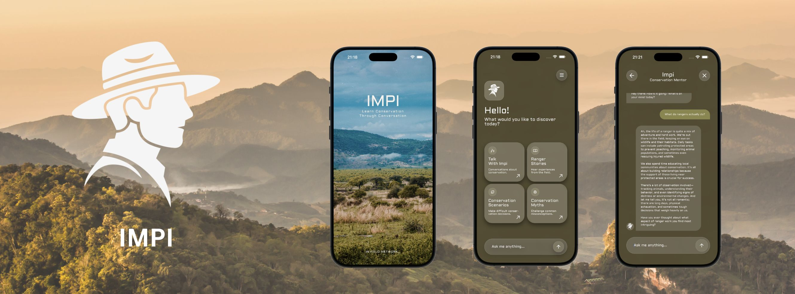

<br>


</div>

---

# Overview

IMPI is an AI-powered conservation education platform designed to bridge the gap between the public and the realities of ranger work.

Developed as an Identity Proxy for the Southern African Wildlife College (SAWC), IMPI allows users to engage directly with an AI conservation mentor, explore ranger stories, complete conservation scenarios, analyse wildlife tracks, and learn about conservation through interactive experiences.

Rather than presenting information through traditional educational methods, IMPI encourages active participation through conversation, storytelling, and decision-making activities that reflect real conservation challenges.

---

# Project Information

| Item | Details |
|--------|--------|
| **Project Name** | IMPI |
| **Student Name** | Iné Smith |
| **Student Number** | 221076 |
| **Project Type** | Identity Proxy |
| **Qualification** | Postgraduate Diploma (PGD) |
| **Institution** | Open Window Institute |
| **Partner Organisation** | Southern African Wildlife College |
| **Platform** | Mobile Application |
| **Target Audience** | General Public, Students & Conservation Enthusiasts |

---

# Research Context

IMPI was developed as an Identity Proxy for the Southern African Wildlife College (SAWC).

The project explores how digital experiences can communicate the knowledge, values, decision-making processes, and lived experiences of conservation professionals to a wider public audience.

Through conversational AI, interactive stories, and educational scenarios, IMPI serves as a digital representative of conservation expertise, making specialist knowledge more accessible and engaging.

---

# Project Aim

The aim of IMPI is to:

- Increase public understanding of ranger work.
- Promote conservation awareness.
- Educate users about wildlife and protected areas.
- Simulate real conservation decision-making.
- Make conservation knowledge more accessible.
- Create an engaging digital identity proxy for SAWC.
- Encourage curiosity and engagement with conservation issues.

---

# Features

## Talk With IMPI

Users can engage in natural conversations with an AI-powered conservation mentor.

Topics include:

- Wildlife
- Ranger work
- Conservation careers
- Protected areas
- Animal behaviour
- Conservation challenges
- Ecosystem management

---

## Ranger Stories

Interactive educational stories that immerse users in real conservation experiences.

Features include:

- Multi-chapter stories
- Reading progress tracking
- Continue reading functionality
- Story completion tracking
- Conservation-based narratives
- Persistent reading progress

---

## Conservation Scenarios

Decision-based learning experiences that place users in ranger-inspired situations.

Users can:

- Analyse conservation scenarios
- Make decisions
- Receive educational feedback
- Learn ranger thinking processes
- Build conservation knowledge

---

## Track Analysis

Users can upload or capture images of wildlife tracks and receive:

- Species identification
- Estimated track age
- Movement direction
- Risk assessment
- Conservation insights

---

## Chat History

IMPI automatically stores conversations allowing users to:

- Continue previous discussions
- Revisit conservation topics
- Track learning progress
- Access previous AI conversations

---

## User Accounts

Users can:

- Create profiles
- Save progress
- Track completed stories
- Continue reading where they left off
- Access personalised experiences

---

# Artificial Intelligence Features

IMPI uses AI to create dynamic educational experiences.

Current AI-powered features include:

- Conservation question answering
- Wildlife education assistance
- Ranger work explanations
- Interactive conservation mentoring
- Dynamic scenario generation
- Personalised learning conversations

The AI is designed to prioritise educational value, conservation awareness, and responsible information sharing.

---

# User Journey

```text
Landing Screen
      ↓
Welcome Screen
      ↓
Login / Sign Up
      ↓
Home Screen
      ↓
 ┌──────────────────────────────────┐
 │                                  │
 ↓                                  ↓
Talk With IMPI              Ranger Stories
 │                                  │
 ↓                                  ↓
Conservation Learning       Story Reader
 │                                  │
 ↓                                  ↓
Conservation Scenarios      Progress Tracking

          ↓

     Track Analysis

          ↓

      User Profile
```

---

# Design System

## Colour Palette

| Colour | Hex |
|---------|---------|
| Charcoal Black | #191818 |
| Sandstone | #CFC4B2 |
| Olive Green | #676127 |
| Earth Brown | #935627 |
| Dark Mahogany | #442827 |

---

## Typography

### Aldrich

Used for:

- Branding
- Titles
- Navigation
- Educational content
- Interface elements
- User interactions

---

# Technology Stack

| Technology | Purpose |
|------------|----------|
| React Native | Mobile Application Development |
| Expo | Development Environment |
| TypeScript | Type Safety |
| Firebase Authentication | User Authentication |
| Cloud Firestore | Database |
| Firebase Functions | Backend Services |
| OpenAI API | AI Conservation Mentor |
| Expo Blur | Glassmorphism Effects |
| Expo Font | Custom Typography |
| Async Storage | Local Data Persistence |

---

# Firebase Architecture

IMPI uses Firebase as its backend infrastructure.

## Authentication

- User Registration
- User Login
- Session Persistence
- Remember Me Functionality

## Firestore Collections

### users
Stores user account information.

### chatHistory
Stores conversations between users and IMPI.

### storyTemplates
Stores story metadata.

### storyChapters
Stores individual story chapters.

### userStoryProgress
Stores reading progress and completion data.

### fieldReports
Stores conservation-related reports.

### fieldSightings
Stores wildlife sighting information.

---

# Installation

## Prerequisites

Before running the project, ensure that the following are installed:

- Node.js
- npm
- Expo CLI
- Visual Studio Code (VS Code)
- Xcode (macOS)

---

## Clone Repository

```bash
git clone https://github.com/inesmith/IMPI-CHATBOT.git
```

---

## Navigate to Project

```bash
cd impi
```

---

## Install Dependencies

```bash
npm install
```

---

## Start Expo

```bash
npx expo start
```

---

# Running the Application

IMPI was developed using React Native, Expo, Firebase, and TypeScript.

## Device Testing Notes

IMPI was designed and tested primarily on an iPhone 16 Pro Max device and simulator.

The application has been developed using responsive React Native layouts; however, final testing and optimisation focused on the target device used throughout development.

## Run the Application

The application can be run using:

- Expo Go on a physical device
- iOS Simulator (macOS)
- Android Emulator

Inside Expo:

```text
i = iOS Simulator
a = Android Emulator
```

---

# Using the iOS Simulator (macOS)

To run IMPI in the iOS Simulator:

1. Ensure Xcode is installed.
2. Open the Simulator:

```text
Xcode → Open Developer Tool → Simulator
```

3. Start Expo:

```bash
npx expo start
```

4. Press:

```text
i
```

inside the Expo terminal.

Alternatively run:

```bash
npx expo run:ios --simulator="iPhone 16 Pro Max"
```

---

# Application Mockups

## Splash Screen

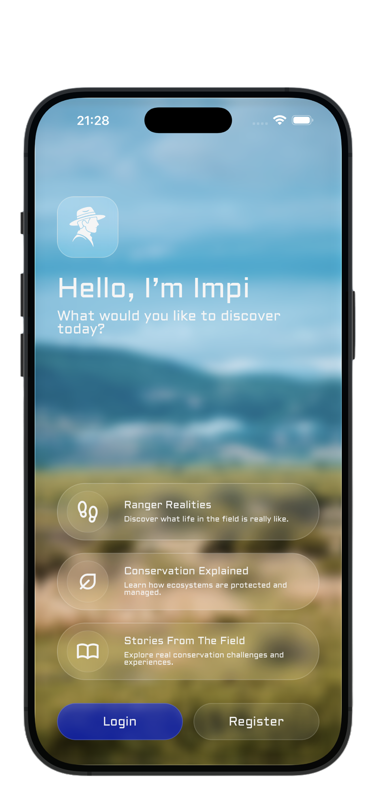

---

## Landing Screen


---

## Signup and Login Screens

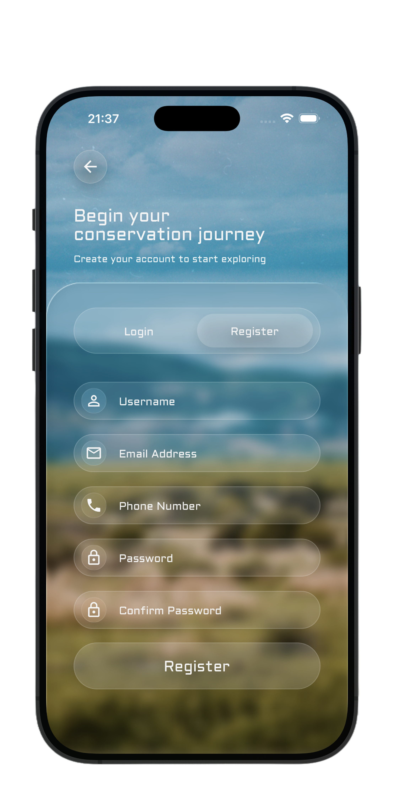
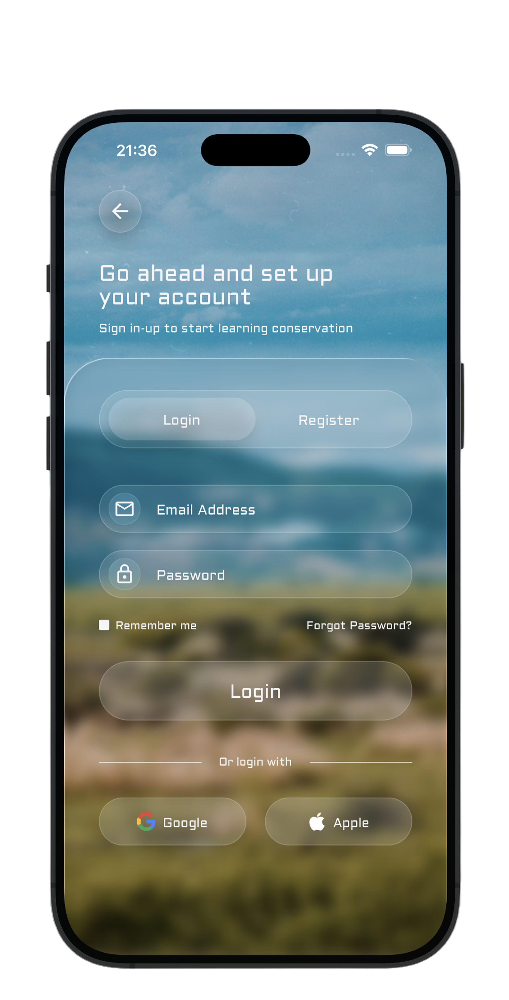

---

## Home Screen

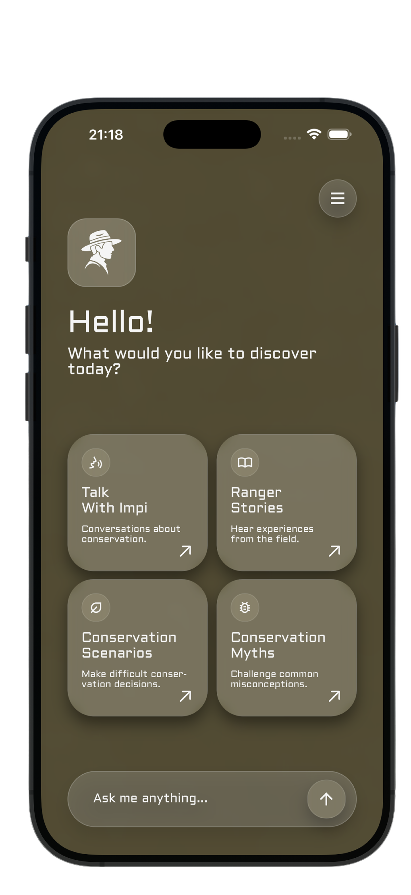

---

## Talk With IMPI

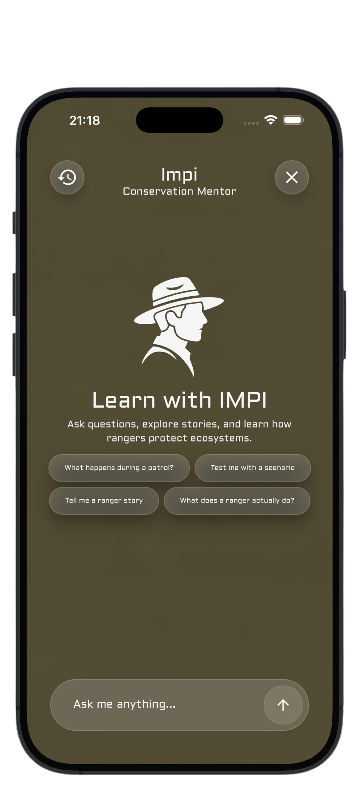
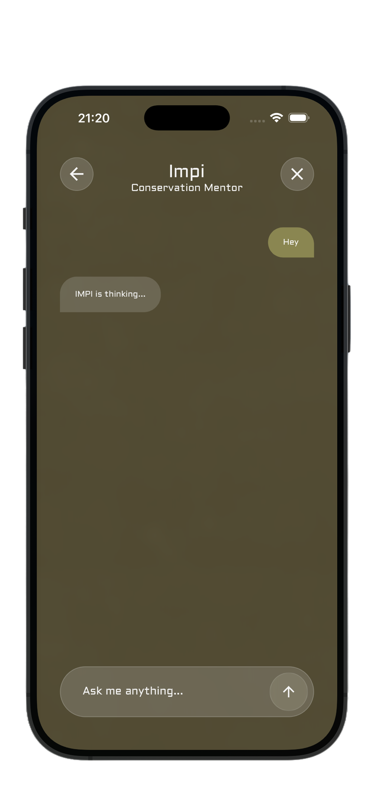
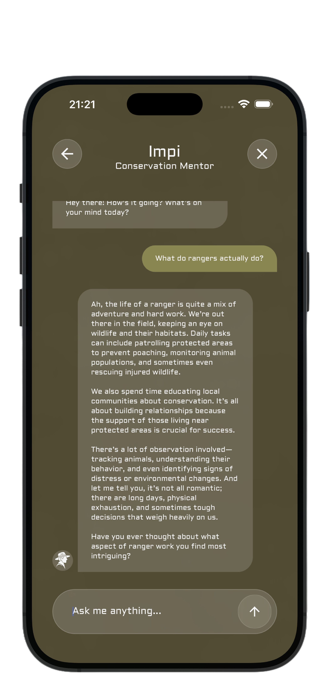

---

## Chat History

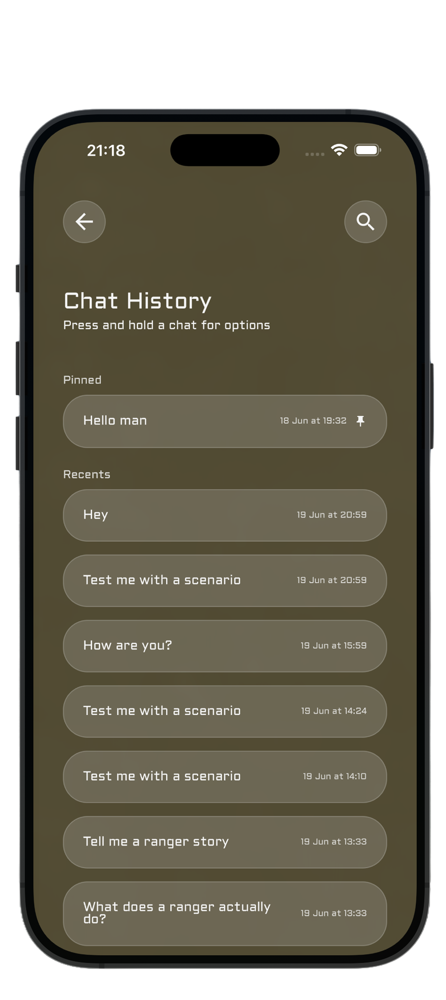
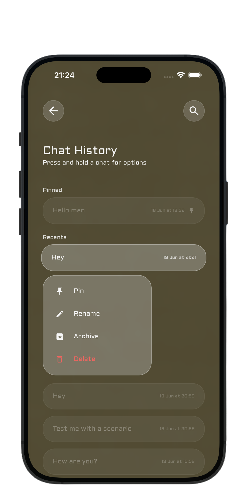

---

## Ranger Stories

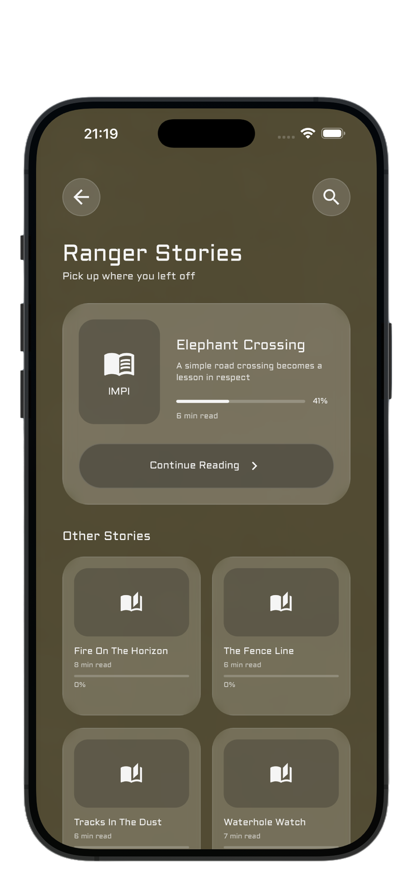
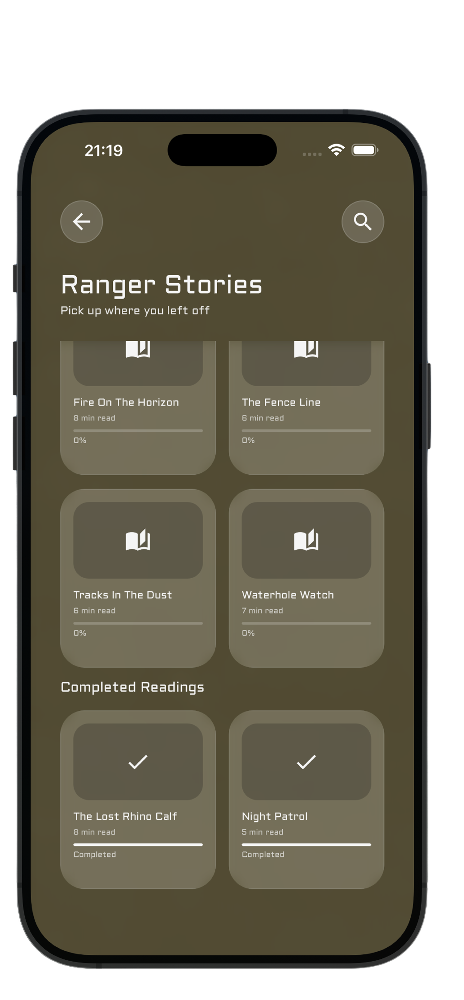
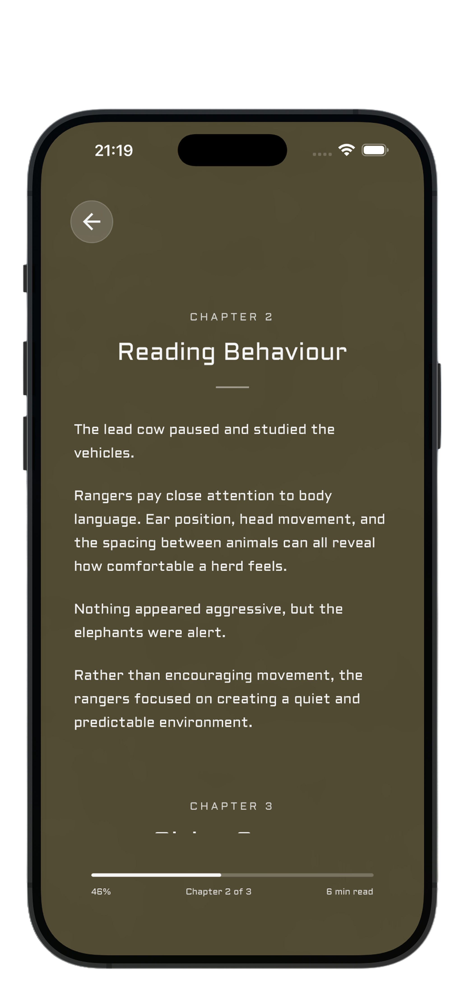

---

## Conservation Scenarios

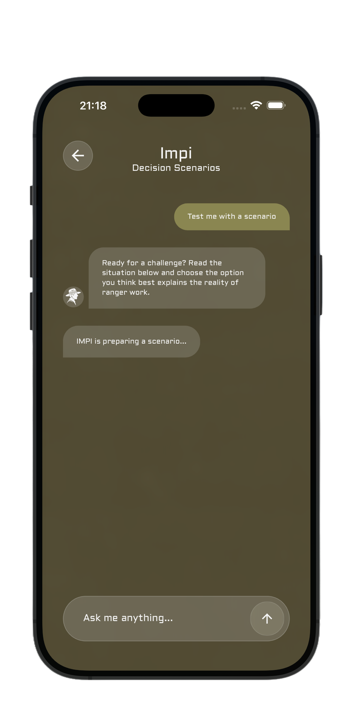
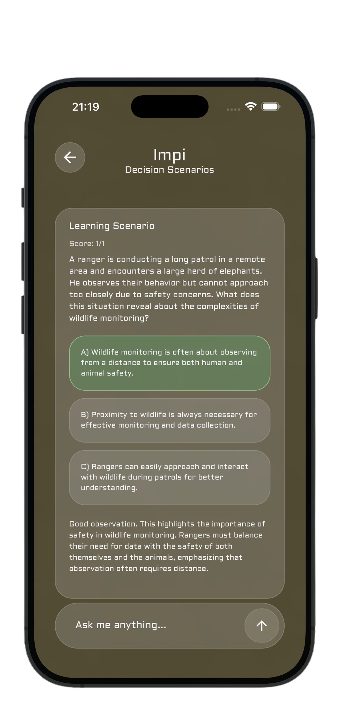
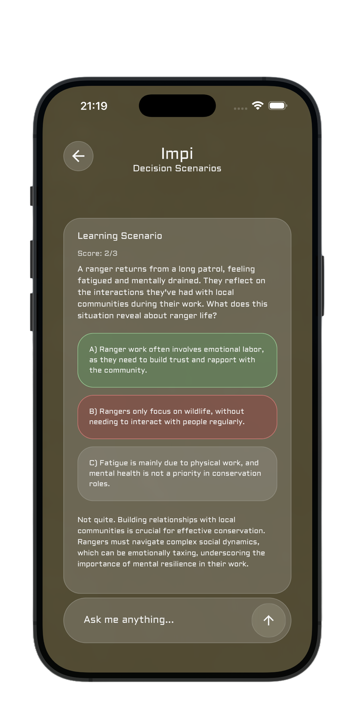

---

## Conservation Myths 

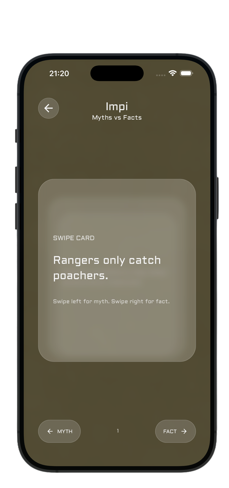
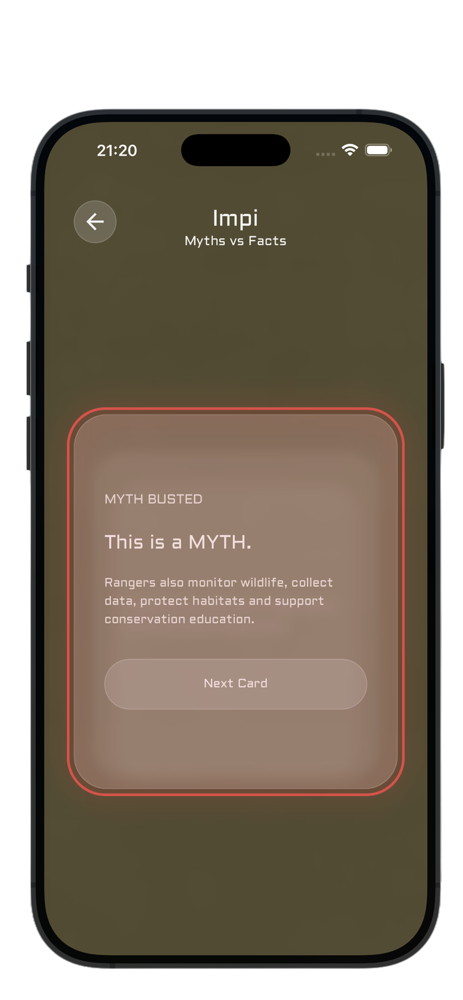

---

## User Profile

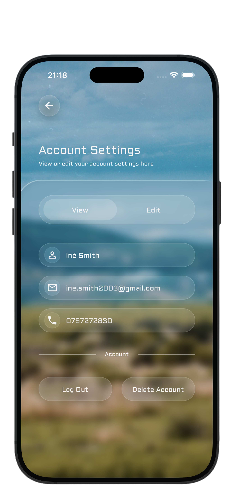
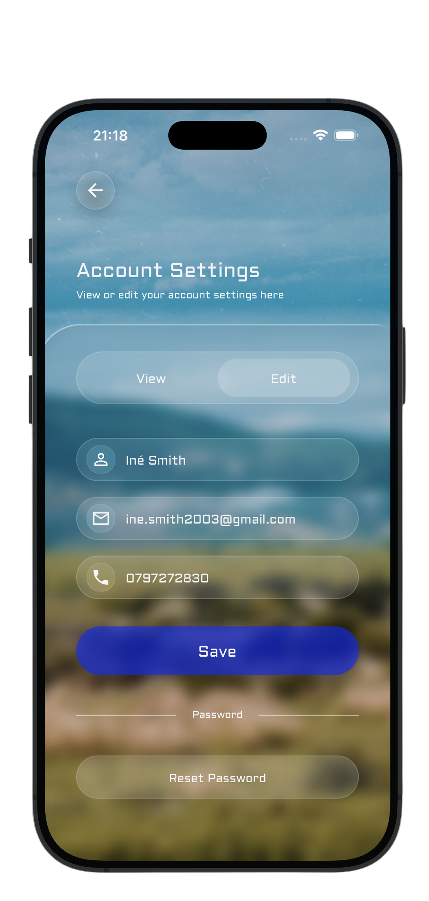

---

# Demonstration Video

A complete walkthrough of IMPI can be viewed below:

### Video Link

🔗 **[Demo Video Link](https://youtu.be/LynBjKayzZA)**

---

# Educational Focus

IMPI explores key conservation concepts including:

- Wildlife behaviour
- Ranger responsibilities
- Protected area management
- Anti-poaching awareness
- Conservation ethics
- Human-wildlife interactions
- Environmental stewardship
- Ecological monitoring

The application demonstrates how conservation professionals use observation, decision-making, and ecological knowledge to protect wildlife.

---

# Project Structure

```text
IMPI
│
├── assets
│   ├── ImpiLogo.png
│   ├── images
│   ├── icons
│   ├── fonts
│   └── mockups
│
├── src
│   ├── screens
│   ├── services
│   ├── components
│   └── utils
│
├── functions
│
├── App.tsx
│
└── firebase.json
```

---

# Known Limitations

Current limitations include:

- AI responses depend on internet connectivity.
- Story content is limited to the current story library.
- The application has been primarily tested on iPhone 16 Pro Max devices and simulator environments.

These limitations have been identified for future development.

---

# Future Development

Potential future enhancements include:

- Voice conversations with IMPI
- Ranger Career Pathways
- Achievement System
- Offline Educational Content
- Expanded Story Library
- Multi-language Support
- Audio Narration
- Interactive Conservation Challenges

---

# Reflection

IMPI explores how conversational AI can be used to communicate conservation knowledge through meaningful digital interactions.

By combining artificial intelligence, storytelling, and decision-based learning, the project transforms conservation education into an engaging and accessible experience.

The application encourages users to learn through participation rather than observation, creating stronger connections between the public and the realities of wildlife conservation.

Through its role as an Identity Proxy, IMPI demonstrates how digital technology can represent and communicate the expertise of conservation professionals to a broader audience.

---

# Author

## Iné Smith

**Student Number:** 221076

**Identity Proxy Project**

**Postgraduate Diploma (PGD)**

**Open Window Institute**

---

# Acknowledgements

Special thanks to:

- Southern African Wildlife College
- OpenAI
- Firebase
- Expo
- Open Window Institute
- Conservation professionals who inspire this work

---

<div align="center">

### "Conservation begins with understanding."

### IMPI helps users experience conservation through conversation.

</div>

<div align="center">

</div>